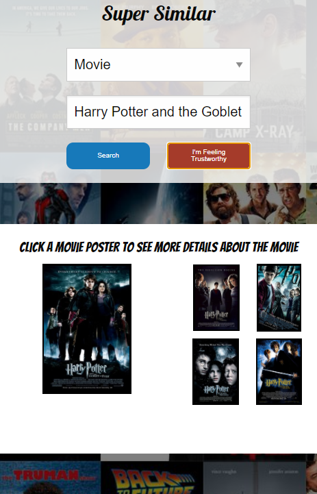
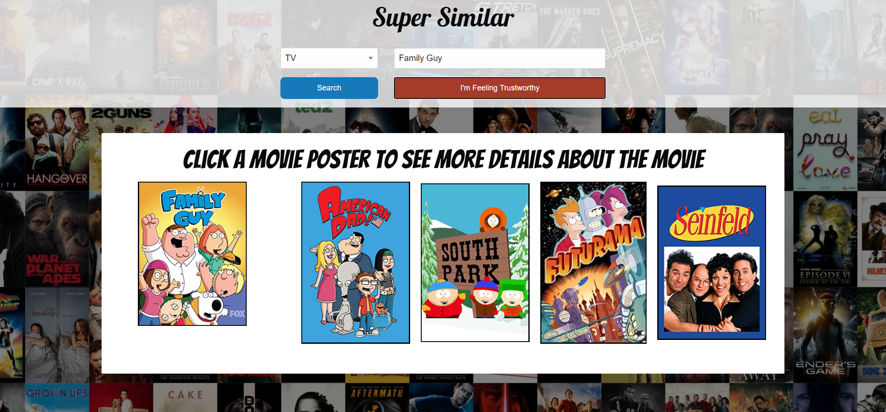
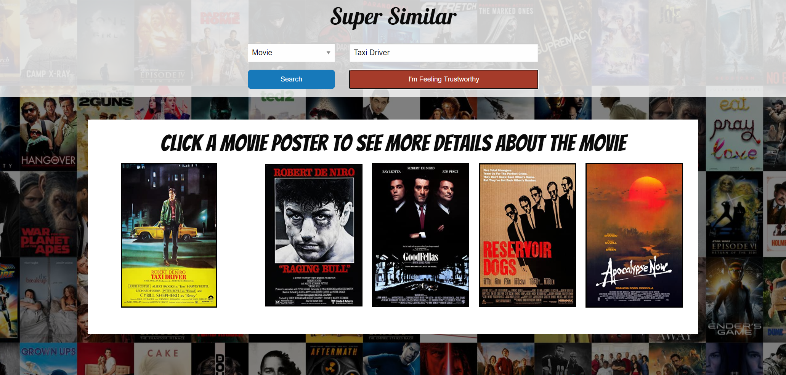
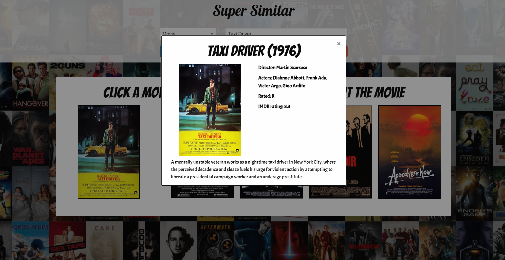

# Super Similar
Super similar was designed to be your go to source for finding something to watch based on the things you know you already enjoy.  For the people who dont even know what they enjoy we also built in a feature that gives you a ideas automatically... you just have to trust it.

## Link to the deployed version
https://ssbrear.github.io/group-project/

## Responsive

This site was designed from the ground up with mobile responsiveness in mind!  We used foundations as our css framework and added some extra touches of our own for a smooth sleek feel.

## Search TV

## Search Movies

## In Depth Details

### Created By
Cynthia Mojica - https://github.com/cynmojica1231
Sebastian Brear - https://github.com/ssbrear
John Baxter - https://github.com/jbaxter91